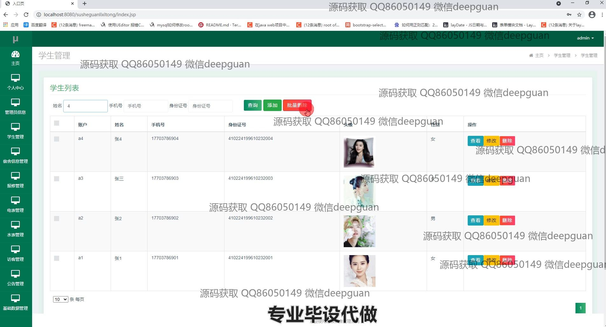
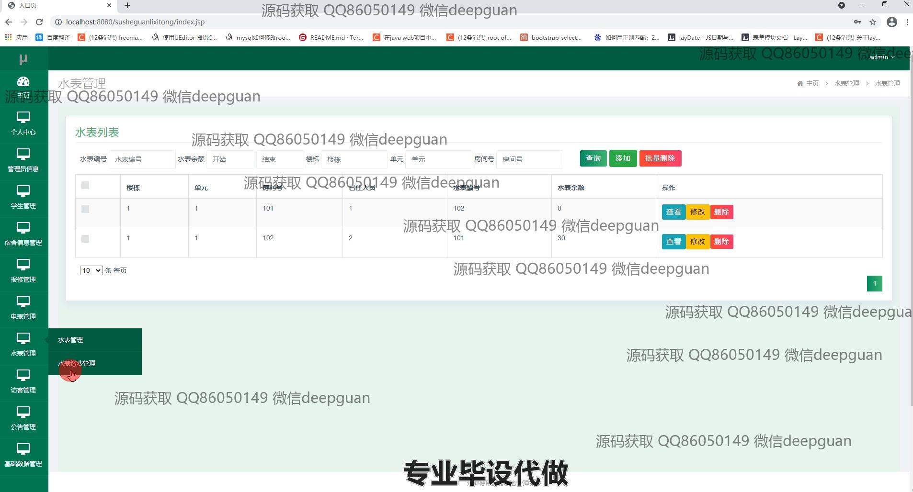
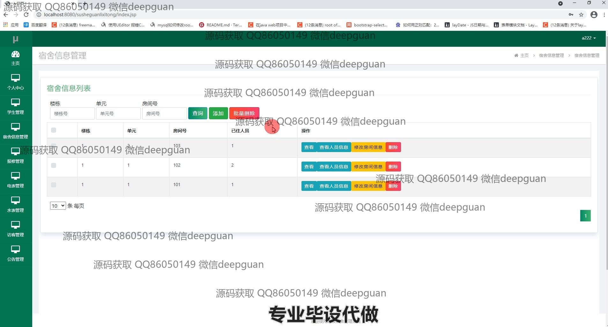

<h1 align="center">高校宿舍管理系统的设计与开发</h1>

## 简介
高校宿舍管理系统：集成管理员、学生和宿舍信息管理，提供报修和访客记录，同时支持电表与水表缴费管理，实现全面高效的宿舍管理服务。    --计算机毕业设计源码；毕设源码；java毕业设计源码

## 联系方式

<h3 align="center">获取完整代码与数据库文件 + 微信：deepguan QQ: 86050149 QQ群: 783742310</h3>

<h3 align="center">可帮忙远程部署 包运行成功！提供远程部署、修改代码、设计文档指导、代码讲解等服务！</h3>

## 功能介绍（完整见运行截图）
管理员： 负责管理整体宿舍信息，包括楼栋、房间号和入住人员信息。可以通过系统进行学生信息的录入、更新与查询。提供公告发布和修改的功能，并管理水电费缴纳记录。实现宿舍卫生检查信息的录入和结果管理，以及访客信息的登记。支持系统用户的注册与信息管理，并处理报修管理请求。具有添加、修改和删除各种管理数据的权限。

宿舍管理员： 主要负责学生的住宿和信息管理，能够查看和更新学生的基本信息如姓名、身份证号和联系方式。可以进行宿舍电表和水表信息的管理，包括查看使用记录和余额，处理水电缴费事宜。实现对访客信息的记录与管理，并定期进行宿舍检查，并记录结果以便日后审查。提供对宿舍日常维修请求的接收与处理。

学生： 学生用户可通过系统进行个人信息的查看与修改，包括手机号、身份证号和上传头像功能。通过个人中心可查阅所属宿舍的相关信息，如电表及水表使用情况和余额。学生可提交报修请求并跟进处理状态。可查看学校发布的公告和相关政策信息。

访客： 访客信息需在系统中进行登记，包括姓名、身份证号和访问原因，确保安全管理。通过填写访访信息与温度记录，完成来访登记。访客的信息由宿舍管理员进行管理与审查，以保障宿舍安全。

## 运行截图

本代码来源于网络,仅供学习参考使用!

